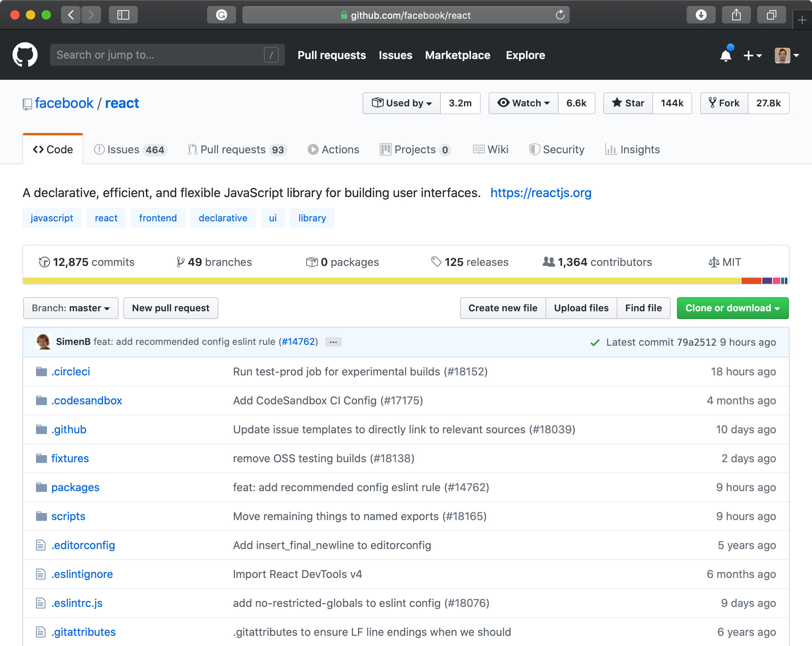

---

*Este artigo faz parte de uma série de artigos sobre o sofware livre e a administração pública, que começa [aqui](/dinheiro-publico-codigo-aberto).*

---

## Interoperabilidade

Ao utilizar software livre, com a ajuda da utilização de standards abertos, estamos também a promover a utilização e desenvolvimento de sistemas que são inter-operáveis. Dois sistemas diferentes que utilizem o mesmo standard aberto, poderão facilmente comunicar entre si, o que reduz muito o custo de integração.

No fundo, mais uma vez, o que a administração pública pretende é ser eficaz, fazer o máximo com o mínimo de custo possível, certo?

> Utilizando software livre e standards abertos, estamos a maximizar a transferibilidade, a interoperabilidade e a acessibilidade do código-fonte. Estamos também a remover a dependência de um qualquer fornecedor.

## Segurança

O código aberto é visto muitas vezes como um impedimento à segurança. Afinal de contas, se os atacantes podem ver o código fonte, eles podem mais facilmente descobrir vulnerabilidades, não é? Acontece que é exatamente ao contrário.

Segurança por obscuridade é um princípio muito falível. A obscuridade funciona até a vulnerabilidade ser descoberta.

A segurança por obscuridade muitas vezes é comparada com o plantar o dinheiro debaixo de uma árvore. Só funciona porque ninguém sabe que está lá. Muito melhor será colocar o dinheiro num cofre forte.

Vejamos o caso do sistema operativo Linux. A segurança de uma aplicação assenta na segurança do sistemas operativo e de todos os serviços que são construídos neste. Ao publicar o código fonte, o Linux garante que temos milhares de olhos permanentemente a escrutinar o código e novas alterações a este à procura de vulnerabilidades. O fato do código ser aberto dá mais segurança, não menos.

*Photo by Matthew Henry on Unsplash*

> Código aberto é código auditável.

# Colaboração e Inovação

O motivo não é ideológico, é organizacional: o Software Livre ajuda a combinar várias tecnologias e conhecimentos de fornecedores independentes, torna a cooperação complexa sem atrito, aprimorando a confiança e reduzindo as despesas gerais de coordenação, além de reduzir as barreiras legais e económicas.

Vejam os exemplos dos projetos e das comunidades à volta de websites como o Github, onde empresas de ponta como a Google, Microsoft, Facebook e muitos outros colaboram e publicam código livre.

> A inovação moderna é complexa, colaborativa e de código aberto.

No [próximo artigo](/dinheiro-publico-codigo-aberto-4) vamos continuar a explorar cada um destes benefícios.

→ [Ler a parte 4 deste artigo](/dinheiro-publico-codigo-aberto-4)
